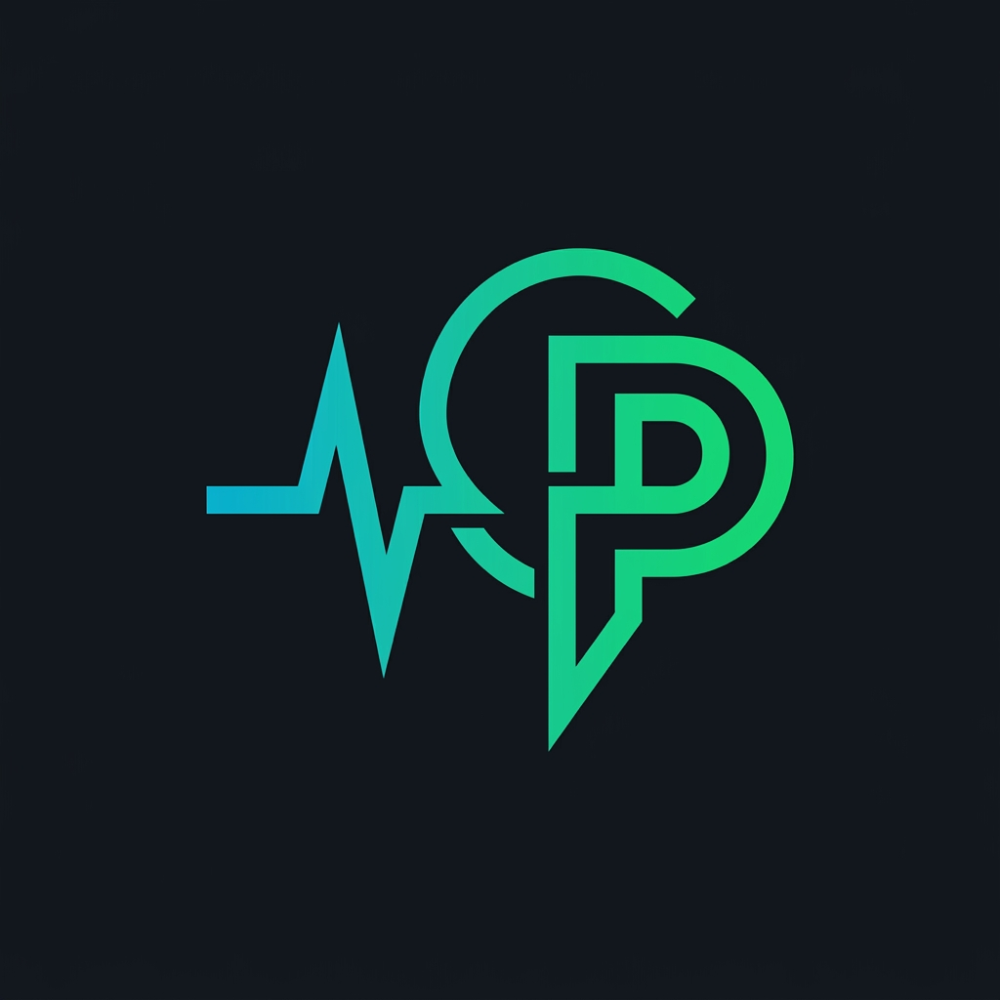

<p align="center">
  
</p>

<h1 align="center">ContextPulse</h1>

<p align="center">
  <strong>Local-first ambient context for AI agents.</strong><br>
  Screen capture, voice dictation, clipboard, keyboard/mouse activity. All local, all private.
</p>

<p align="center">
  <a href="LICENSE"></a>
  
  
  
</p>

---

> **Developer Preview (v0.1-alpha).** ContextPulse is under active development. APIs and configuration may change between releases. [Report issues](https://github.com/ContextPulse/contextpulse/issues).

ContextPulse is a desktop daemon that captures your screen, voice, and keyboard/mouse activity in real time, then delivers it to AI agents through the [Model Context Protocol (MCP)](https://modelcontextprotocol.io). One process, one tray icon, 35 MCP tools, zero cloud dependency.

Everything stays local. No cloud. No telemetry. Your data never leaves your machine.

```
┌─────────────────────────────────────────────────┐
│              ContextPulse Daemon                 │
│                                                  │
│  ┌──────────┐  ┌──────────┐  ┌──────────┐      │
│  │  Sight   │  │  Voice   │  │  Touch   │      │
│  │ Screen   │  │ Dictate  │  │ Keys +   │      │
│  │ OCR      │  │ Whisper  │  │ Mouse    │      │
│  │ Clipboard│  │ Vocab    │  │ Bursts   │      │
│  └────┬─────┘  └────┬─────┘  └────┬─────┘      │
│       └──────────────┼──────────────┘            │
│                      ▼                           │
│              ┌──────────────┐                    │
│              │  EventBus    │                    │
│              │  (Spine)     │                    │
│              └──────┬───────┘                    │
│                     ▼                            │
│              ┌──────────────┐                    │
│              │ activity.db  │                    │
│              │ SQLite+FTS5  │                    │
│              └──────────────┘                    │
└────────────────────┬────────────────────────────┘
                     │ MCP (streamable-http :8420)
        ┌────────────┼────────────┐
        ▼            ▼            ▼
   Claude Code    Cursor      Any MCP
                              Client
```

## Quick Demo

```
> You: "What am I looking at right now?"

Claude calls get_screenshot → get_screen_text:

  Active window: VS Code, src/auth/middleware.ts
  OCR text: "export async function validateToken(req: Request)..."
  Clipboard: "Bearer eyJhbGciOiJIUzI1NiIs..."

> Claude: "You're editing the auth middleware in VS Code.
>          I can see the validateToken function, and you have
>          a Bearer token in your clipboard. Want me to help
>          debug the token validation?"
```

```
> You hold Ctrl+Space and say: "refactor this to use the new auth provider"

ContextPulse Voice transcribes → pastes into editor
Claude calls get_recent_transcriptions → get_screen_text:

> Claude: "I can see your dictation and the current file.
>          Here's the refactored middleware using AuthProvider..."
```

```
> You: "What was I working on before lunch?"

Claude calls get_activity_summary(hours=4) → search_history("auth"):

  10:15 AM  VS Code, auth/middleware.ts (45 min)
  11:00 AM  Chrome, JWT.io (12 min)
  11:15 AM  VS Code, auth/tests/test_middleware.py (30 min)
  11:45 AM  Slack, #backend channel (15 min)

> Claude: "You spent the morning on auth middleware: writing
>          the implementation, checking JWT specs, then adding
>          tests. You were in Slack #backend right before lunch."
```

## Why ContextPulse?

AI coding assistants are powerful but blind. They can't see your screen, hear your voice notes, or know what you were just doing. ContextPulse bridges this gap:

- **Local-first, zero cloud dependency.** Your screen, voice, and input data never leave your machine. No accounts, no subscriptions, no third-party servers. Privacy by architecture, not by policy.
- **MCP-native from day one.** ContextPulse exposes all context as MCP tools. Any MCP client (Claude Desktop, Cursor, Windsurf, VS Code) gets full context without custom integrations.
- **True multi-modal in a single daemon.** Screen capture, voice dictation, keyboard/mouse input, and semantic memory run in one lightweight process (<1% CPU). No stitching multiple tools together.
- **Open source (AGPL-3.0).** Fully auditable, self-hostable, and extensible. No vendor lock-in, no SaaS dependency, no risk of acquisition-driven shutdowns.

### What Makes ContextPulse Different

| Capability | ContextPulse | Typically Available? |
|---|---|---|
| **Screen capture + OCR** | Yes, native resolution | Common |
| **Voice dictation** | Yes, local Whisper | Rare as integrated feature |
| **Keyboard + mouse tracking** | Yes | Rare |
| **Semantic memory** | Yes, three-tier with hybrid search | Rare |
| **All modalities in one daemon** | Yes, single lightweight process | No, usually separate tools |
| **MCP-native** | Yes, 35 tools | Emerging |
| **100% local, zero cloud** | Yes, privacy by architecture | Uncommon |
| **Open source** | AGPL-3.0 | Varies |

### Platform Support

| Platform | Status |
|----------|--------|
| Windows 10+ | Full support |
| macOS 13+ (Apple Silicon and Intel) | Full support |
| Linux | Community contributions welcome -- core abstractions are in place, platform modules need implementation |

## Installation

```bash
git clone https://github.com/ContextPulse/contextpulse
cd contextpulse
pip install -e packages/core -e packages/screen -e packages/voice -e packages/touch -e packages/project

# Optional: persistent memory + semantic search
pip install -e packages/memory
```

Configure your AI agent and install companion skills:

```bash
contextpulse --setup claude-code   # configures MCP + installs skills
# or: contextpulse --setup gemini  # for Gemini CLI
# or: contextpulse --setup all     # both
```

Start ContextPulse:

```bash
contextpulse       # starts the background daemon
contextpulse-mcp   # starts the MCP server on port 8420
```

That's it. Your AI agent now has tools for reading your screen, voice, activity, and memory.

<details>
<summary>Manual MCP configuration (if not using --setup)</summary>

Add to `~/.claude.json`:

```json
{
  "mcpServers": {
    "contextpulse": {
      "type": "http",
      "url": "http://127.0.0.1:8420/mcp"
    }
  }
}
```
</details>

## MCP Tools

### Sight (11 free tools)

| Tool | What it does |
|------|-------------|
| `get_screenshot` | Capture screen (active monitor, all monitors, or a region) |
| `get_recent` | Recent frames from the rolling buffer (with diff filtering) |
| `get_screen_text` | OCR the current screen at native resolution |
| `get_monitor_summary` | Lightweight text summary of all monitors (low token cost) |
| `get_buffer_status` | Daemon health check + buffer stats |
| `get_activity_summary` | App usage breakdown over last N hours |
| `search_history` | Full-text search across window titles + OCR text |
| `get_context_at` | Frame + metadata from N minutes ago |
| `get_clipboard_history` | Recent clipboard entries |
| `search_clipboard` | Search clipboard by text content |
| `get_agent_stats` | Which MCP clients are consuming context, and how often |

### Voice (3 free tools)

| Tool | What it does |
|------|-------------|
| `get_recent_transcriptions` | Recent voice dictation history (raw + cleaned) |
| `get_voice_stats` | Dictation count, duration, accuracy stats |
| `get_vocabulary` | Current word correction entries |

### Touch (3 free tools)

| Tool | What it does |
|------|-------------|
| `get_recent_touch_events` | Typing bursts, clicks, scrolls, drags |
| `get_touch_stats` | Keystroke count, WPM, click/scroll totals |
| `get_correction_history` | Voice-to-typing correction detections |

### Project (5 free tools)

| Tool | What it does |
|------|-------------|
| `identify_project` | Score text against all projects, return best match |
| `get_active_project` | Detect current project from CWD or window title |
| `list_projects` | All indexed projects with overviews |
| `get_project_context` | Full PROJECT_CONTEXT.md for a project |
| `route_to_journal` | Route an insight to the project journal |

### Memory (5 free + 2 Pro tools)

Basic memory is **free forever**. No license required.

| Tool | Tier | What it does |
|------|------|-------------|
| `memory_store` | Free | Store a key-value memory with optional tags and TTL |
| `memory_recall` | Free | Retrieve a memory by exact key |
| `memory_list` | Free | List memories, optionally filtered by tag |
| `memory_forget` | Free | Delete a memory by key |
| `memory_stats` | Free | Storage statistics (entry counts, DB sizes, tiers) |
| `memory_search` | Pro | Hybrid/keyword/semantic search across all stored memories |
| `memory_semantic_search` | Pro | Pure vector search using all-MiniLM-L6-v2 embeddings |

Memory uses a 3-tier hot/warm/cold architecture: in-memory LRU cache → SQLite WAL + FTS5 → compressed archive. The optional `pip install contextpulse-memory` package ships these tools.

### Pro (4 tools, requires license or 30-day trial)

| Tool | What it does |
|------|-------------|
| `memory_search` | Hybrid/keyword/semantic search across stored memories |
| `memory_semantic_search` | Pure vector search using sentence embeddings |
| `search_all_events` | Cross-modal full-text search across screen, voice, clipboard, keys |
| `get_event_timeline` | Temporal view of all events across all modalities |

**Free forever:** 27 tools (Sight × 11, Voice × 3, Touch × 3, Project × 5, Memory × 5)
**Pro:** adds 4 search tools: semantic memory search plus cross-modal event queries
**Trial:** 30-day Pro trial on first use, no credit card required

Additionally, ContextPulse includes several background learning tools (vocabulary consolidation, correction detection) that run automatically to improve transcription quality over time.

## Architecture

ContextPulse is a monorepo with modular packages:

| Package | Purpose |
|---------|---------|
| `contextpulse-core` | Daemon, EventBus (spine), config, licensing, settings |
| `contextpulse-sight` | Screen capture, OCR, clipboard monitoring |
| `contextpulse-voice` | Hold-to-dictate, Whisper transcription, vocabulary |
| `contextpulse-touch` | Keyboard/mouse activity capture, correction detection |
| `contextpulse-project` | Project detection and journal routing |
| `contextpulse-memory` | Persistent key-value memory with semantic search (optional) |

All modules emit events to a shared **EventBus** (the "spine"), which writes to a local SQLite database with FTS5 full-text search. MCP servers are read-only processes that query this database.

## Development

```bash
git clone https://github.com/ContextPulse/contextpulse
cd contextpulse
uv venv
.venv\Scripts\activate
uv pip install -e "packages/core[dev]" -e packages/screen -e packages/voice -e packages/touch -e packages/project
pytest packages/ -x -q
```

See [CONTRIBUTING.md](CONTRIBUTING.md) for guidelines.

## Canary Health Check

A canary script exercises every exposed MCP tool and reports pass/fail. It runs automatically on a cron/Task Scheduler schedule to catch regressions before users do.

```bash
# Run manually
python scripts/canary_health_check.py

# Verbose (shows each tool as it runs)
python scripts/canary_health_check.py --verbose

# JSON output (for CI or external monitoring)
python scripts/canary_health_check.py --json
```

**What it does:**
- Auto-starts the ContextPulse daemon if it is not already running
- Calls all primary MCP tools with minimal valid arguments
- Prints a human-readable summary with per-server breakdown
- Appends results to `logs/canary_results.json` (last 100 runs retained)
- Exits `0` if all tools pass, `1` if any fail

**Scheduling (Windows Task Scheduler):**

1. Open Task Scheduler → Create Basic Task
2. Trigger: Daily, repeat every 4 hours
3. Action: Start a program
   - Program: `<path-to-contextpulse>\.venv\Scripts\python.exe`
   - Arguments: `scripts/canary_health_check.py`
   - Start in: `<path-to-contextpulse>`

## License

ContextPulse is licensed under the [GNU Affero General Public License v3.0](LICENSE) (AGPL-3.0).

- You can use, modify, and distribute ContextPulse freely
- If you modify and deploy it as a service, you must open-source your changes
- Commercial licensing available for embedding in proprietary products

For commercial licensing inquiries, visit [contextpulse.ai](https://contextpulse.ai).

## Patent Notice

ContextPulse's unified multi-modal context delivery system is patent pending.

---

<p align="center">
  Built by <a href="https://contextpulse.ai">Jerard Ventures LLC</a>
</p>
